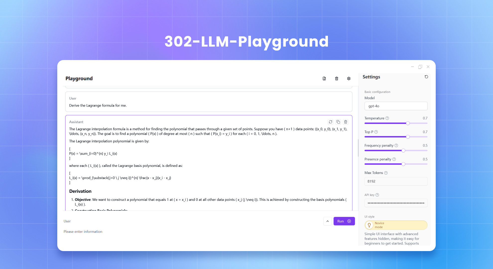
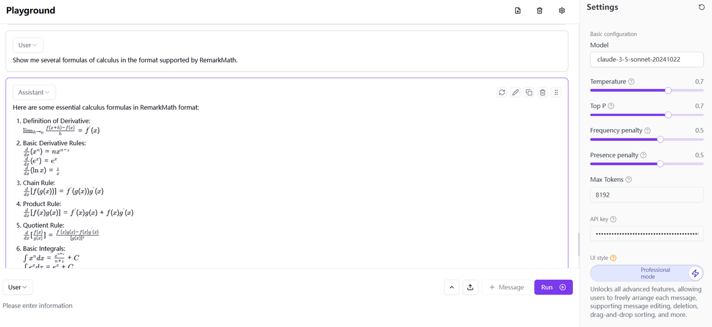
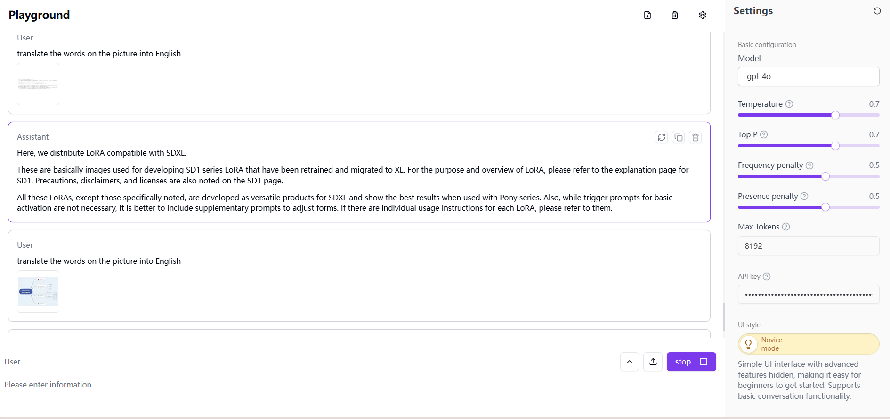
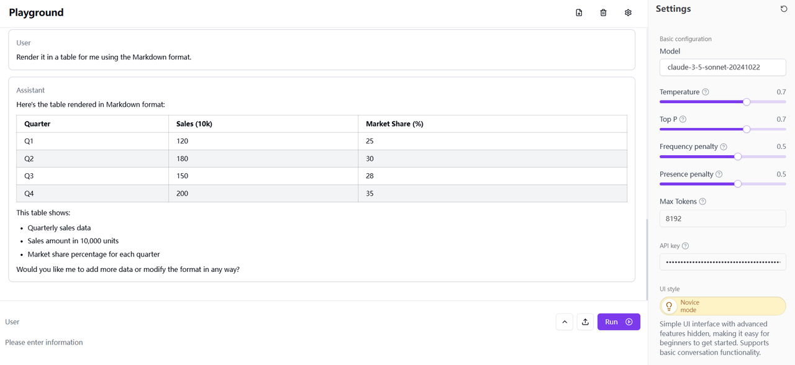
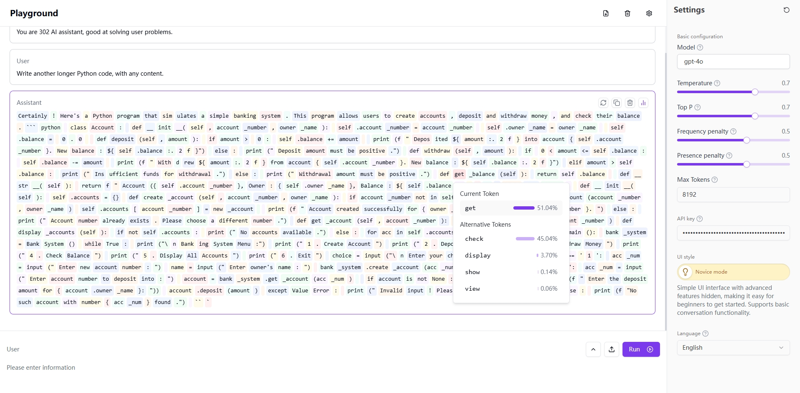

# <p align="center">🤖 LLM Playground 🚀✨</p>

<p align="center">A powerful and interactive experimental platform for experimenting with large language models, built based on Next.js 14 and modern web technologies.</p>

<p align="center"><a href="https://302.ai/en/apis/" target="blank"></a></p >

<p align="center"><a href="README_zh.md">中文</a> | <a href="README.md">English</a> | <a href="README_ja.md">日本語</a></p>




## Interface Preview 
   Generate results based on user input, supporting Latex expression rendering.
       

   Images can be uploaded as context for dialogue.
       

   Support chart rendering.
       

   The OpenAI model has the function of displaying token probabilities. It can obtain the probability of the currently selected token and provide multiple alternative tokens as well as their probabilities.
   


## ✨ Key Features ✨

1. **Interactive Chat Interface**
   - Real-time markdown editing and preview
   - Role-based conversations
   - Users can upload images for conversation.
   - Under the OpenAI model, token probabilities can be displayed.
   - Advanced message manipulation: reorder, copy, regenerate
   - Expert Mode: enhanced editing and role controls
   - Feedback and animations for seamless UX
   - Model configuration and AI parameter tuning
   - Responsive and accessible design

2. **Rich Text Editor**
   - Advanced markdown with GitHub Flavored support
   - KaTeX for LaTeX expressions
   - Mermaid for diagram rendering
   - Persistent content and live rendering


3. **Modern User Experience**
   - Customizable and responsive UI
   - Animations, notifications, and error handling
   - Mobile-friendly with accessible components

4. **Advanced Features**
   - IndexedDB persistence, multiple language support
   - API integration and message history management
   - Advanced logging and optimized API handling
   - Internationalization and dynamic translations

## Tech Stack 🛠️

- **Framework**: Next.js 14
- **Languages**: TypeScript
- **Styling**: Tailwind CSS, Radix UI
- **State Management**: Jotai
- **Data Storage**: IndexedDB with Dexie.js
- **Internationalization**: next-intl

## Project Structure 📁

```plaintext
src/
├── actions/
├── app/
├── components/
│   ├── playground/
│   └── ui/
├── constants/
├── db/
├── hooks/
├── i18n/
├── stores/
├── styles/
└── utils/
```

## Getting Started 🚀

### Prerequisites

- Node.js (LTS version)
- pnpm or npm
- 302.AI API Key

### Installation

1. Clone the repository:
   ```bash
   git clone https://github.com/302ai/302_llm_playground
   cd 302_llm_playground
   ```
   
2. Install dependencies:
   ```bash
   pnpm install
   ```

3. Configure environment variables:
   ```bash
   cp .env.example .env.local
   ```

   - `AI_302_API_KEY`: Your 302.AI API key
   - `AI_302_API_URL`: API endpoint

### Development

Start the development server:

```bash
pnpm dev
```

Visit [http://localhost:3000](http://localhost:3000) to see the application.

### Production Build

```bash
pnpm build
pnpm start
```

## Docker Deployment 🐳

Build and run using Docker:

```bash
docker build -t llm_playground .
docker run -p 3000:3000 llm_playground
```

## Contributing 🤝

Contributions are welcome! Please feel free to submit issues and pull requests.

## License 📜

This project is licensed under the GNU Affero General Public License v3.0. See the [LICENSE](LICENSE) file for more details.

---

Built with ❤️ using Next.js and 302.AI

## ✨ About 302.AI ✨
[302.AI](https://302.ai) is an enterprise-oriented AI application platform that offers pay-as-you-go services, ready-to-use solutions, and an open-source ecosystem.✨
1. 🧠 Comprehensive AI capabilities: Incorporates the latest in language, image, audio, and video models from leading AI brands.
2. 🚀 Advanced application development: We build genuine AI products, not just simple chatbots.
3. 💰 No monthly fees: All features are pay-per-use, fully accessible, ensuring low entry barriers with high potential.
4. 🛠️ Powerful admin dashboard: Designed for teams and SMEs - managed by one, used by many.
5. 🔗 API access for all AI features: All tools are open-source and customizable (in progress).
6. 💡 Powerful development team: Launching 2-3 new applications weekly with daily product updates. Interested developers are welcome to contact us.
