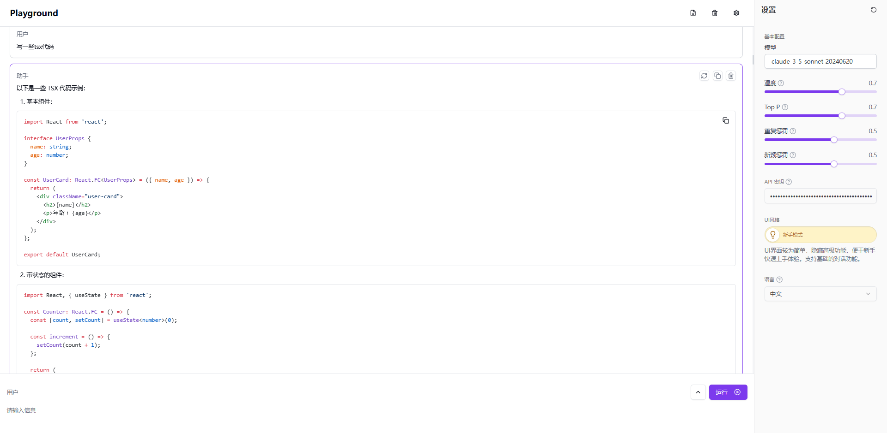
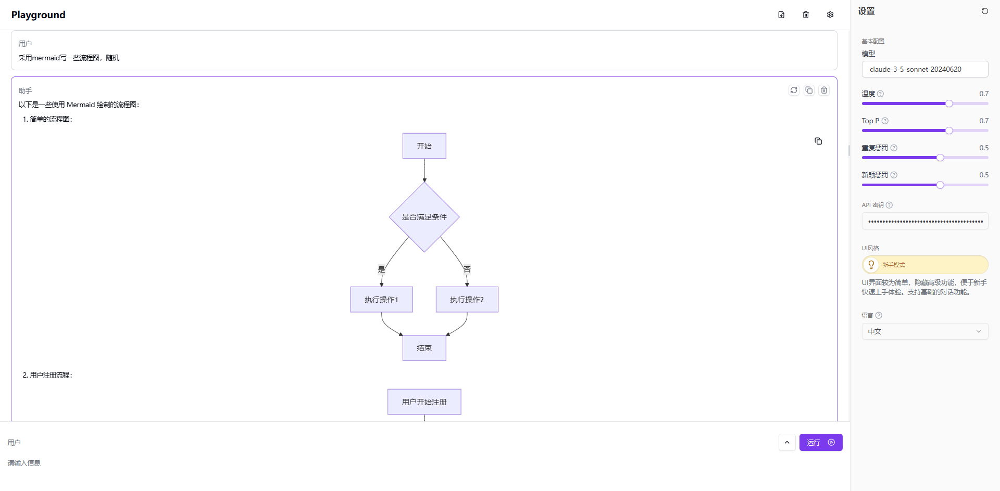
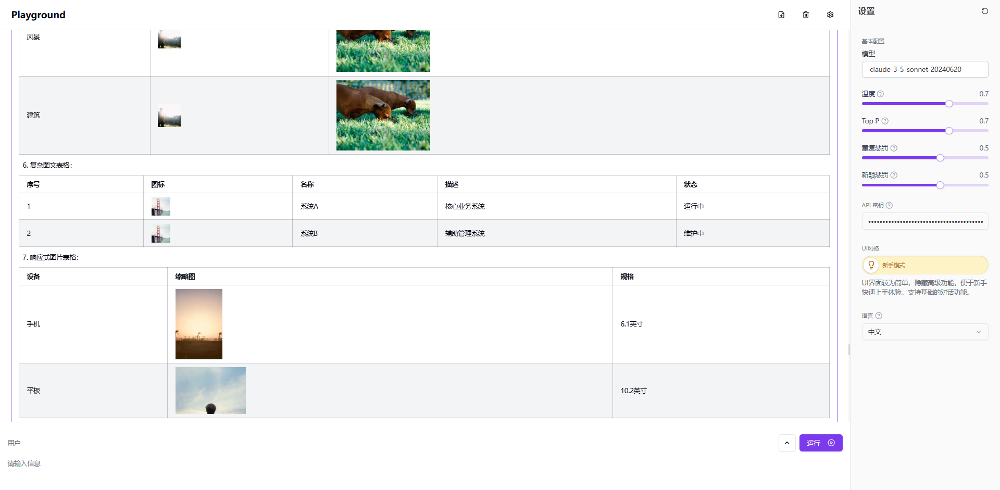

# 🤖 Welcome to 302.AI's LLM Playground! 🚀✨

[中文](README_zh.md) | [English](README.md) | [日本語](README_ja.md)

A powerful and interactive playground for experimenting with Large Language Models, built with Next.js 14 and modern web technologies.


## ✨ About 302.AI ✨
[302.AI](https://302.ai) is a pay-as-you-go AI application platform, bridging the gap between AI capabilities and practical implementation. 💡✨
1. 🧠 Comprehensive AI capabilities: Incorporates the latest in language, image, audio, and video models from leading AI brands.
2. 🚀 Advanced application development: We build genuine AI products, not just simple chatbots.
3. 💰 No monthly fees: All features are pay-per-use, fully accessible, ensuring low entry barriers with high potential.
4. 🛠️ Powerful admin dashboard: Designed for teams and SMEs - managed by one, used by many.
5. 🔗 API access for all AI features: All tools are open-source and customizable (in progress).
6. 💡 Powerful development team: Launching 2-3 new applications weekly with daily product updates. Interested developers are welcome to contact us.

## ✨ Key Features ✨

1. **Interactive Chat Interface**
   - Real-time markdown editing and preview
   - Role-based conversations
   - Advanced message manipulation: reorder, copy, regenerate
   - Expert Mode: enhanced editing and role controls
   - Feedback and animations for seamless UX
   - Model configuration and AI parameter tuning
   - Responsive and accessible design

   

2. **Rich Text Editor**
   - Advanced markdown with GitHub Flavored support
   - KaTeX for LaTeX expressions
   - Mermaid for diagram rendering
   - Persistent content and live rendering

   
   
   
   

3. **Modern User Experience**
   - Customizable and responsive UI
   - Animations, notifications, and error handling
   - Mobile-friendly with accessible components

4. **Advanced Features**
   - IndexedDB persistence, multiple language support
   - API integration and message history management
   - Advanced logging and optimized API handling
   - Internationalization and dynamic translations

## Tech Stack 🛠️

- **Framework**: Next.js 14
- **Languages**: TypeScript
- **Styling**: Tailwind CSS, Radix UI
- **State Management**: Jotai
- **Data Storage**: IndexedDB with Dexie.js
- **Internationalization**: next-intl

## Project Structure 📁

```plaintext
src/
├── actions/
├── app/
├── components/
│   ├── playground/
│   └── ui/
├── constants/
├── db/
├── hooks/
├── i18n/
├── stores/
├── styles/
└── utils/
```

## Getting Started 🚀

### Prerequisites

- Node.js (LTS version)
- pnpm or npm
- 302.AI API Key

### Installation

1. Clone the repository:
   ```bash
   git clone <repository-url>
   cd llm_playground
   ```
   
2. Install dependencies:
   ```bash
   pnpm install
   ```

3. Configure environment variables:
   ```bash
   cp .env.example .env.local
   ```

   - `AI_302_API_KEY`: Your 302.AI API key
   - `AI_302_API_URL`: API endpoint

### Development

Start the development server:

```bash
pnpm dev
```

Visit [http://localhost:3000](http://localhost:3000) to see the application.

### Production Build

```bash
pnpm build
pnpm start
```

## Docker Deployment 🐳

Build and run using Docker:

```bash
docker build -t llm-playground .
docker run -p 3000:3000 llm-playground
```

## Contributing 🤝

Contributions are welcome! Please feel free to submit issues and pull requests.

## License 📜

This project is licensed under the GNU Affero General Public License v3.0. See the [LICENSE](LICENSE) file for more details.

---

Built with ❤️ using Next.js and 302.AI
