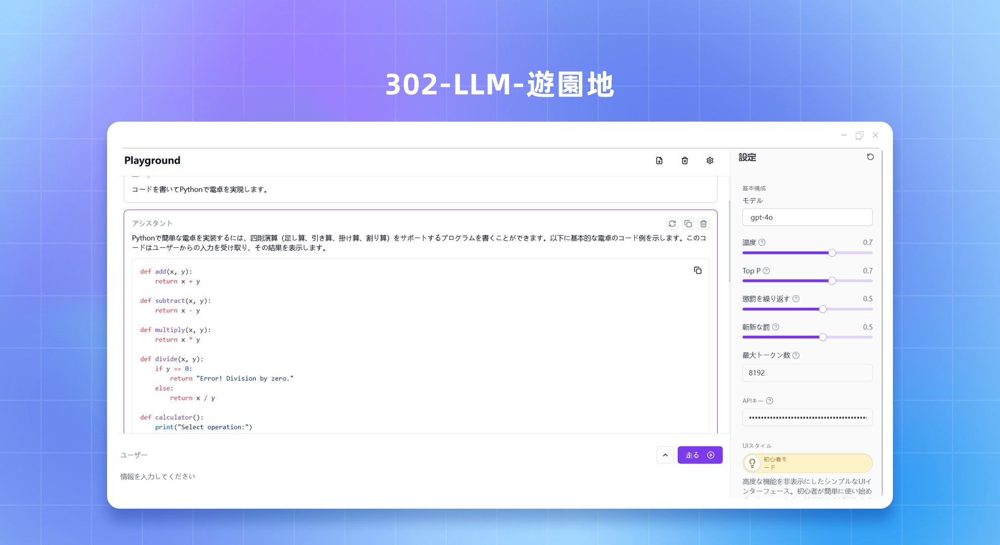
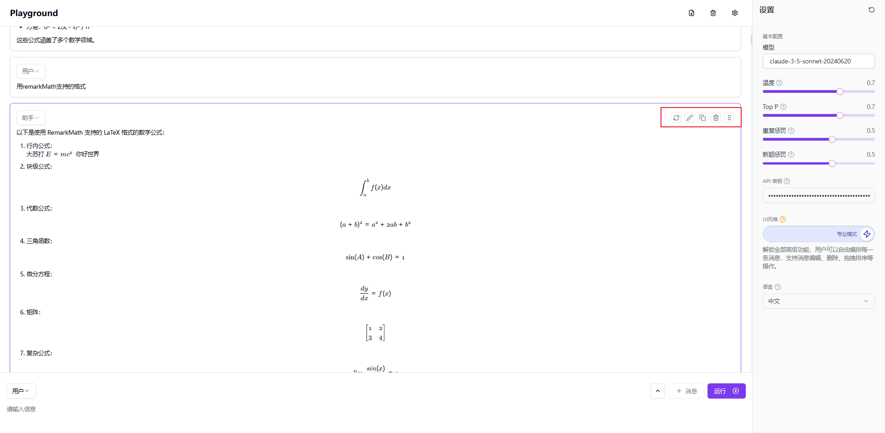
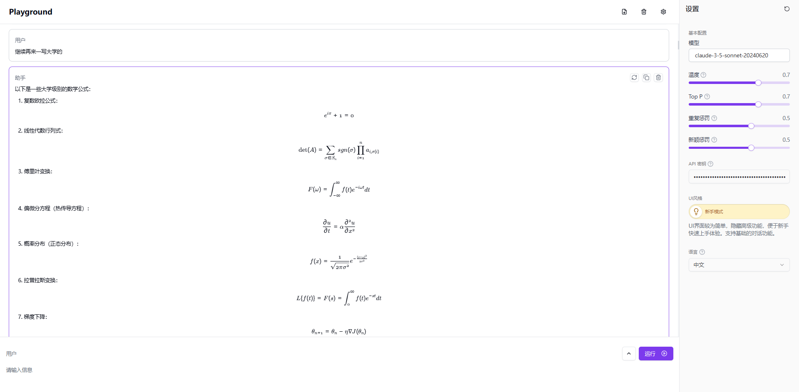
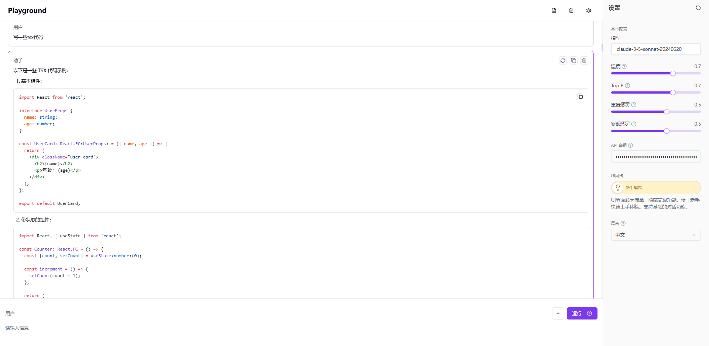
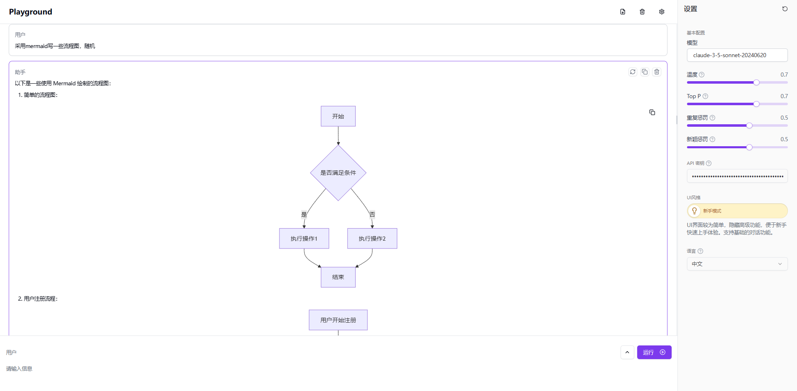
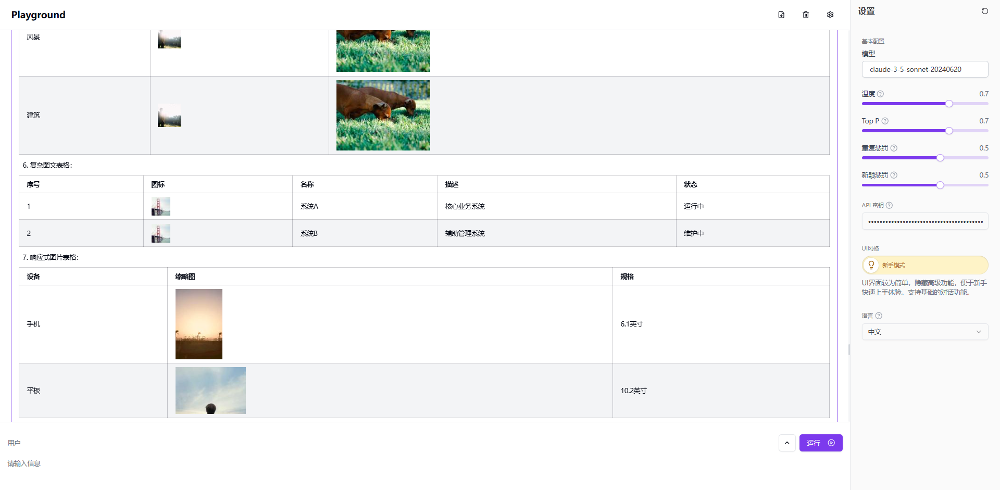

# <p align="center">🤖 LLMプレイグラウンド🚀✨</p>

<p align="center">Next.js 14と最新のWeb技術を使用して構築された、大規模言語モデルを実験するための強力でインタラクティブなプレイグラウンドです。</p>

<p align="center"><a href="https://302.ai/ja/apis/" target="blank"></a></p >

<p align="center"><a href="README_zh.md">中文</a> | <a href="README.md">English</a> | <a href="README_ja.md">日本語</a></p>




## ✨ 主な機能 ✨

1. **インタラクティブチャットインターフェース**
   - リアルタイムのMarkdown編集とプレビュー
   - 役割ベースの会話
   - 高度なメッセージ操作：並べ替え、コピー、再生成
   - エキスパートモード：強化された編集と役割制御
   - シームレスなUXのためのフィードバックとアニメーション
   - モデル設定とAIパラメータ調整
   - レスポンシブでアクセス可能なデザイン

   

2. **リッチテキストエディタ**
   - GitHub Flavoredの高度なMarkdownサポート
   - LaTeX表現のためのKaTeX
   - Mermaidによる図のレンダリング
   - 永続的なコンテンツとライブレンダリング

   
   
   
   

3. **モダンなユーザーエクスペリエンス**
   - カスタマイズ可能でレスポンシブなUI
   - アニメーション、通知、エラーハンドリング
   - モバイルフレンドリーでアクセス可能なコンポーネント

4. **高度な機能**
   - IndexedDBの永続性、多言語サポート
   - API統合とメッセージ履歴管理
   - 高度なログ記録と最適化されたAPI処理
   - 国際化と動的翻訳

## 技術スタック 🛠️

- **フレームワーク**: Next.js 14
- **言語**: TypeScript
- **スタイリング**: Tailwind CSS, Radix UI
- **状態管理**: Jotai
- **データストレージ**: IndexedDB with Dexie.js
- **国際化**: next-intl

## プロジェクト構造 📁

```plaintext
src/
├── actions/
├── app/
├── components/
│   ├── playground/
│   └── ui/
├── constants/
├── db/
├── hooks/
├── i18n/
├── stores/
├── styles/
└── utils/
```

## はじめに 🚀

### 前提条件

- Node.js (LTSバージョン)
- pnpmまたはnpm
- 302.AI APIキー

### インストール

1. リポジトリをクローン：
   ```bash
   git clone https://github.com/302ai/302_llm_playground
   cd 302_LLM_playground

   ```
   
2. 依存関係をインストール：
   ```bash
   pnpm install
   ```

3. 環境変数を設定：
   ```bash
   cp .env.example .env.local
   ```

   - `AI_302_API_KEY`: あなたの302.AI APIキー
   - `AI_302_API_URL`: APIエンドポイント

### 開発

開発サーバーを起動：

```bash
pnpm dev
```

[http://localhost:3000](http://localhost:3000) にアクセスしてアプリケーションを確認。

### 本番ビルド

```bash
pnpm build
pnpm start
```

## Dockerデプロイ 🐳

Dockerを使用してビルドと実行：

```bash
docker build -t llm-playground .
docker run -p 3000:3000 llm-playground
```

## 貢献 🤝

貢献は歓迎します！問題やプルリクエストを自由に提出してください。

## ライセンス 📜

このプロジェクトはGNU Affero General Public License v3.0の下でライセンスされています。詳細は[LICENSE](LICENSE)ファイルを参照してください。

---

Next.jsと302.AIを使用して❤️で構築 

## ✨ 302.AIについて ✨
[302.AI](https://302.ai)は、AIの能力と実際の実装のギャップを埋める、従量課金制のAIアプリケーションプラットフォームです。💡✨
1. 🧠 包括的なAI機能：主要なAIブランドからの最新の言語、画像、音声、ビデオモデルを統合。
2. 🚀 高度なアプリケーション開発：単なるチャットボットではなく、本物のAI製品を構築。
3. 💰 月額料金なし：すべての機能は従量課金制で、完全にアクセス可能で、低い参入障壁と高い可能性を保証。
4. 🛠️ 強力な管理ダッシュボード：チームや中小企業向けに設計され、一人で管理し、多くの人が使用。
5. 🔗 すべてのAI機能のAPIアクセス：すべてのツールはオープンソースでカスタマイズ可能（進行中）。
6. 💡 強力な開発チーム：毎週2〜3の新しいアプリケーションを立ち上げ、毎日製品を更新。興味のある開発者はぜひご連絡ください。
