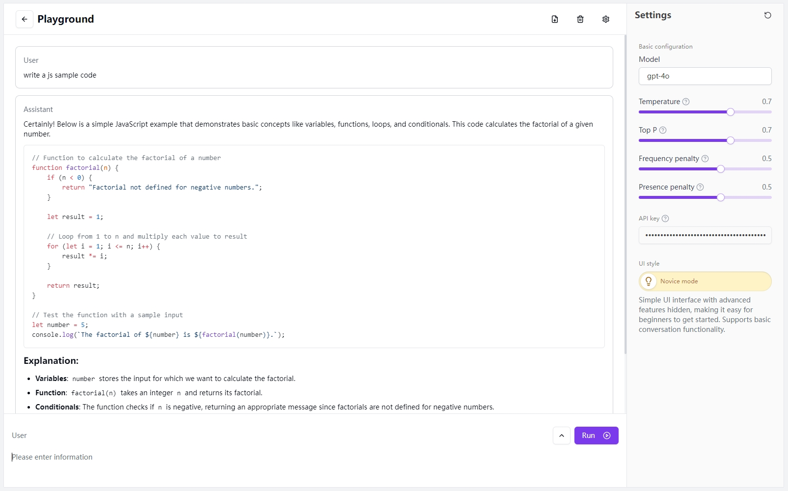
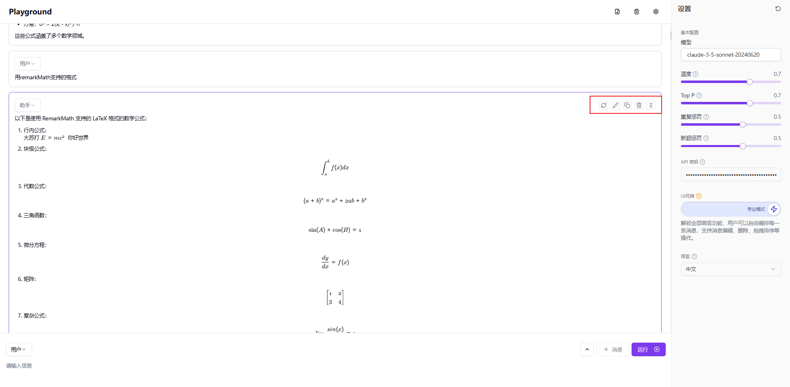
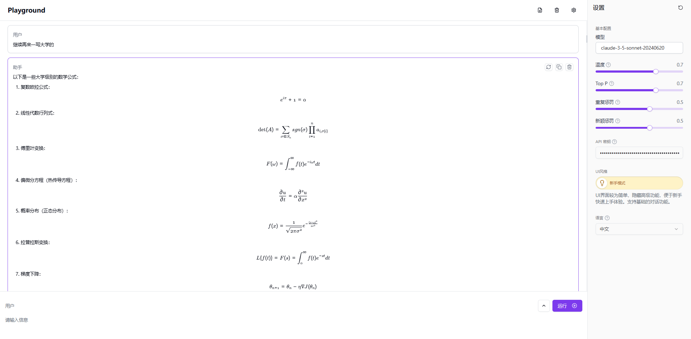

# <p align="center">🤖 LLM Playground🚀✨</p>

<p align="center">一个强大且互动的实验平台，用于实验大型语言模型，基于 Next.js 14 和现代 Web 技术构建。</p>

<p align="center"><a href="https://302.ai/tools/word/" target="blank"></a></p >

<p align="center"><a href="README zh.md">中文</a> | <a href="README.md">English</a> | <a href="README_ja.md">日本語</a></p>




## ✨ 主要功能 ✨

1. **互动聊天界面**
   - 实时 Markdown 编辑和预览
   - 基于角色的对话
   - 高级消息操作：重新排序、复制、重新生成
   - 专家模式：增强的编辑和角色控制
   - 无缝用户体验的反馈和动画
   - 模型配置和 AI 参数调整
   - 响应式和可访问的设计

   

2. **富文本编辑器**
   - 支持 GitHub 风格的高级 Markdown
   - 支持 LaTeX 表达式的 KaTeX
   - 支持 Mermaid 图表渲染
   - 持久化内容和实时渲染

   
   
   
   

3. **现代用户体验**
   - 可定制和响应式的 UI
   - 动画、通知和错误处理
   - 移动友好且可访问的组件

4. **高级功能**
   - IndexedDB 持久化，多语言支持
   - API 集成和消息历史管理
   - 高级日志记录和优化的 API 处理
   - 国际化和动态翻译

## 技术栈 🛠️

- **框架**: Next.js 14
- **语言**: TypeScript
- **样式**: Tailwind CSS, Radix UI
- **状态管理**: Jotai
- **数据存储**: IndexedDB with Dexie.js
- **国际化**: next-intl

## 项目结构 📁

```plaintext
src/
├── actions/
├── app/
├── components/
│   ├── playground/
│   └── ui/
├── constants/
├── db/
├── hooks/
├── i18n/
├── stores/
├── styles/
└── utils/
```

## 快速开始 🚀

### 先决条件

- Node.js (LTS 版本)
- pnpm 或 npm
- 302.AI API 密钥

### 安装

1. 克隆仓库：
   ```bash
   git clone <repository-url>
   cd llm_playground
   ```
   
2. 安装依赖：
   ```bash
   pnpm install
   ```

3. 配置环境变量：
   ```bash
   cp .env.example .env.local
   ```

   - `AI_302_API_KEY`: 您的 302.AI API 密钥
   - `AI_302_API_URL`: API 端点

### 开发

启动开发服务器：

```bash
pnpm dev
```

访问 [http://localhost:3000](http://localhost:3000) 查看应用。

### 生产构建

```bash
pnpm build
pnpm start
```

## Docker 部署 🐳

使用 Docker 构建和运行：

```bash
docker build -t llm-playground .
docker run -p 3000:3000 llm-playground
```

## 贡献 🤝

欢迎贡献！请随时提交问题和拉取请求。

## 许可证 📜

本项目根据 GNU Affero General Public License v3.0 许可。详情请参阅 [LICENSE](LICENSE) 文件。

---

使用 Next.js 和 302.AI 构建 ❤️

## ✨ 302.AI介绍 ✨
[302.AI](https://302.ai)是一个按需付费的AI应用平台，为用户解决AI用于实践的最后一公里问题。
1. 🧠 集合了最新最全的AI能力和品牌，包括但不限于语言模型、图像模型、声音模型、视频模型。
2. 🚀 在基础模型上进行深度应用开发，我们开发真正的AI产品，而不是简单的对话机器人
3. 💰 零月费，所有功能按需付费，全面开放，做到真正的门槛低，上限高。
4. 🛠 功能强大的管理后台，面向团队和中小企业，一人管理，多人使用。
5. 🔗 所有AI能力均提供API接入，所有工具开源可自行定制（进行中）。
6. 💡 强大的开发团队，每周推出2-3个新应用，产品每日更新。有兴趣加入的开发者也欢迎联系我们
